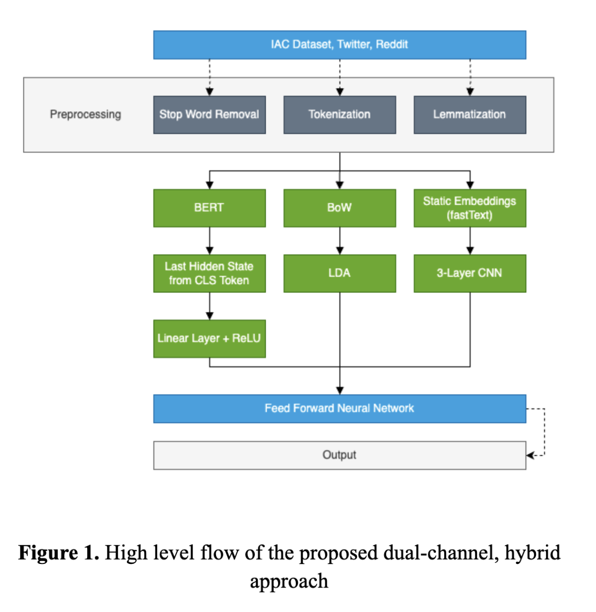

# CASCADE - Context-Aware Sarcasm Detection Model

CASCADE is a novel hybrid Natural Language Processing (NLP) model designed to enhance sarcasm detection in domain-specific contexts. The model employs a Dual-Channel BERT approach that incorporates BERT, Convolutional Neural Networks (CNN), and Latent Dirichlet Allocation (LDA) topic modeling to achieve accurate sarcasm detection by leveraging both static and contextual embeddings.



## Features

- **Hybrid Model Architecture:** Combines BERT for contextual embeddings, CNN for feature extraction, and LDA for topic modeling.
- **Domain-Specific Performance:** Fine-tuned on Twitter and Reddit datasets to improve sarcasm detection in social media contexts.
- **Efficient Transfer Learning:** Achieves a performance of 50.75% with reduced transfer learning time.
- **Implementation:** Developed using PyTorch, Hugging Face Transformers, and NLTK.

## Installation

To use the CASCADE model, follow these installation steps:

1. **Clone the Repository:**

   ```bash
   git clone https://github.com/yourusername/cascade.git
   cd cascade
   # Install required libraries
   pip install -r requirements.txt


# Directory Structure
   ```bash
   /checkpoint 
   ├── best_model.pth           # Trained model checkpoint
   ├── lda_set.pt               # LDA topic model checkpoint
   └── /pretrain_iac            # Pre-trained model configs
       ├── config.json
       └── model.safetensors    # Pre-trained weights
   
   /dataset 
   ├── train_df.csv             # Training dataset
   ├── test_df.csv              # Test dataset
   └── preprocessing.py         # Data preprocessing script
   
   /model 
   ├── base_transformer.py      # Transformer base model
   ├── benchmarktest.py         # Performance testing script
   └── hybridmodel.py           # Hybrid model definition
```

## Model usage 
To call the cascade model import via the following statement :
```bash
from model.hybridmodel import SarcasmModel
```


# Model Hyperparameters Report

## Model Architecture

| Layer      | Description                  |
|------------|------------------------------|
| **CONV 1** | Kernel Size: 3 <br> Number of Kernels: 64 |
| **POOL 1** | Kernel Size: 2               |
| **CONV 2** | Kernel Size: 3 <br> Number of Kernels: 32 |
| **POOL 2** | Kernel Size: 2               |
| **CONV 3** | Kernel Size: 3 <br> Number of Kernels: 16 |
| **POOL 3** | Kernel Size: 2               |

## Training Parameters

| Parameter    | Value |
|--------------|-------|
| Batch Size   | 32    |
| Epochs        | 5     |

## Notes

- **Model Design:** The model includes three convolutional layers and three pooling layers. The number of kernels decreases progressively from 64 to 16 in the convolutional layers.
- **Training:** The model was trained using a batch size of 32 for 5 epochs. 

Please ensure that you understand the purpose of each layer and hyperparameter to replicate or further modify the model as needed.

